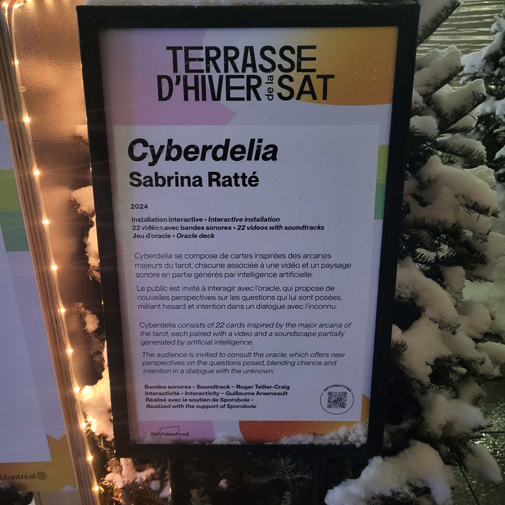
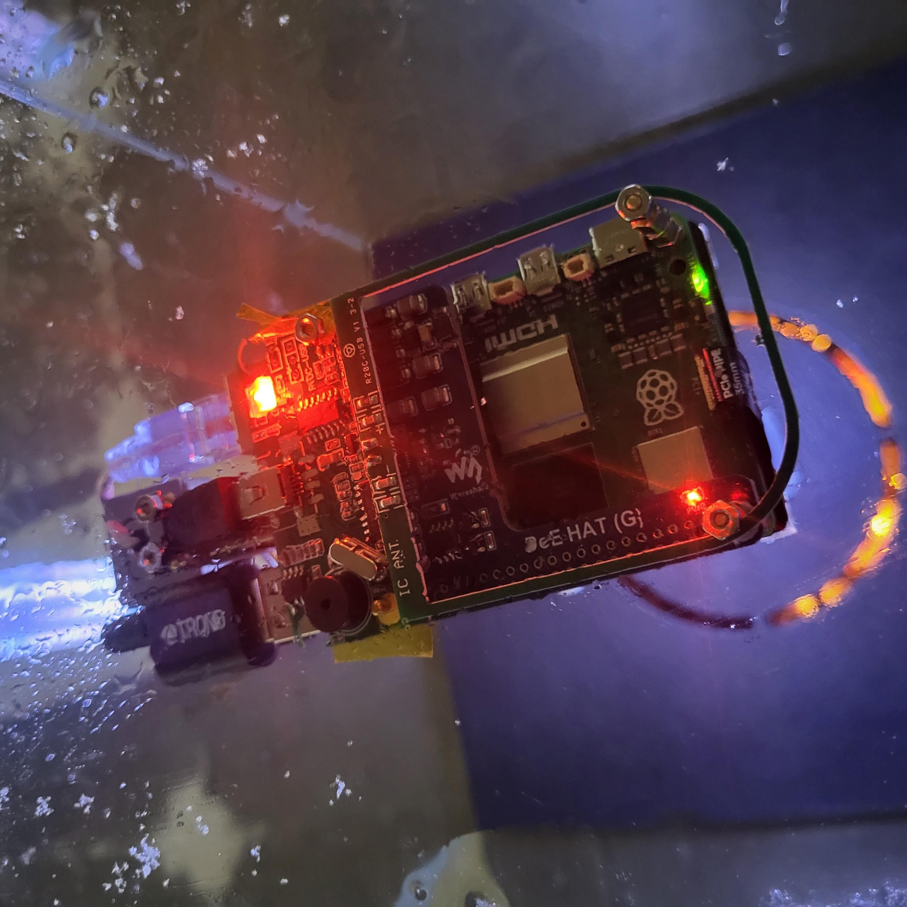

<h1>Oeuvre Cyberdelia </h1>

J’ai eu la chance d’assister à une exposition réalisée par l’artiste Sabrina Ratté intitulée Cyberdelia. Cyberdelia est une œuvre conçue par Sabrina Ratté lors d'une résidence au centre Sporobole pour explorer les potentialités créatives de l'intelligence artificielle. 

 |  
:-------------------------:|:-------------------------:

Sur la terrasse de la Sat à montréal était installé cette œuvre composée d’un projecteur, des speakers et même un scanner créé à partir d’un raspberry pi. 22 vidéos différentes peuvent être déclenchées à l’aide de 22 cartes qui peuvent être scannées sur un piédestal de verre contenant le raspberry pi. Chaque carte est assignée à une vidéo projetée sur le grand mur en face du piédestal lumineux et des hauts-parleurs entourent le tout.

 |  
:-------------------------:|:-------------------------:

L’intégration de l’intelligence artificielle dans l’art est un sujet plutôt complexe et cette œuvre pour moi ne m’as vraiment pas touché à cause de ça. Les 22 vidéos mentionnées sont majoritairement faites à l'aide d’ IA et je peux comprendre puisque l'œuvre se veut d’être une sorte d’échange avec l’inconnu mais ce n'est tout de même pas assez pour justifier une telle quantité de matériel visuel généré par IA. Je dois admettre par contre que le dispositif utilisé pour scanner les cartes est très beau même sous la pluie.

 |  
:-------------------------:|:-------------------------:
