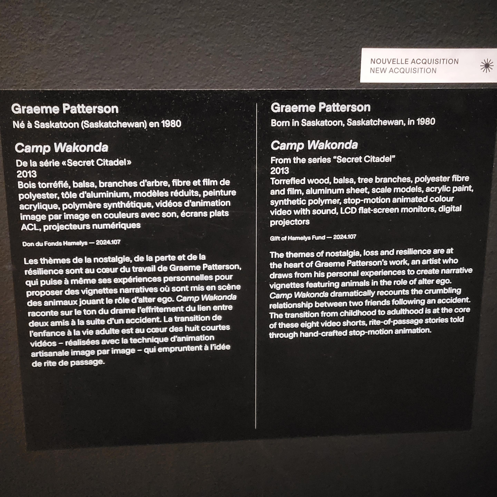
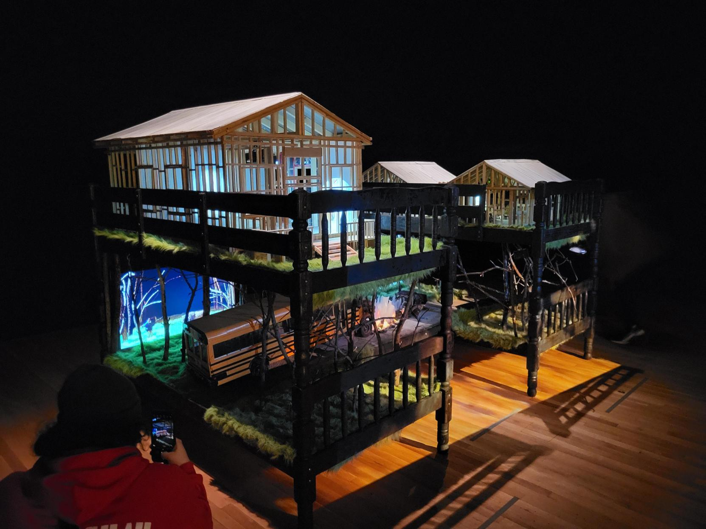
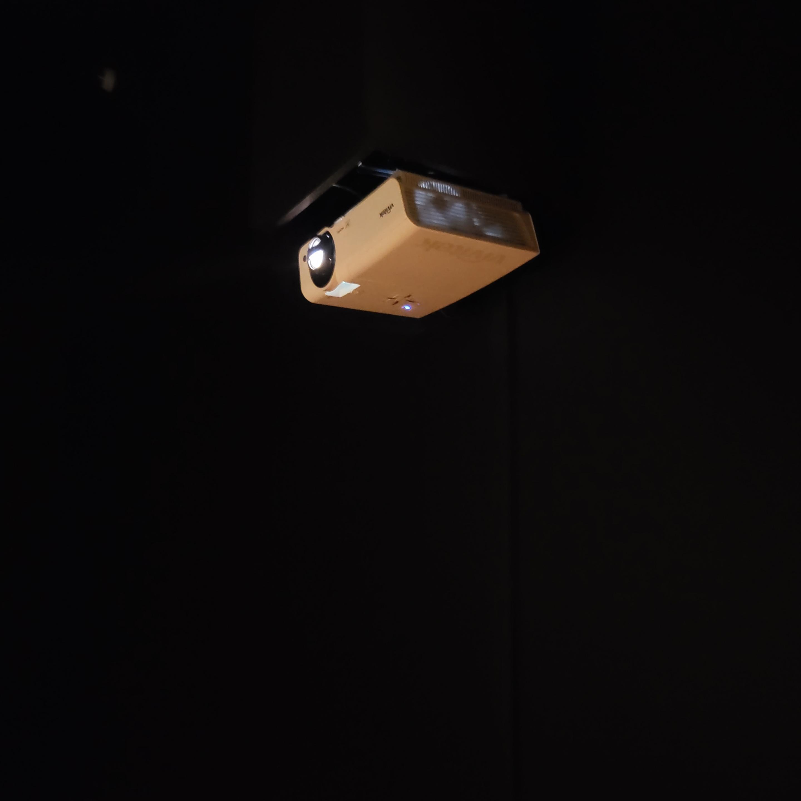
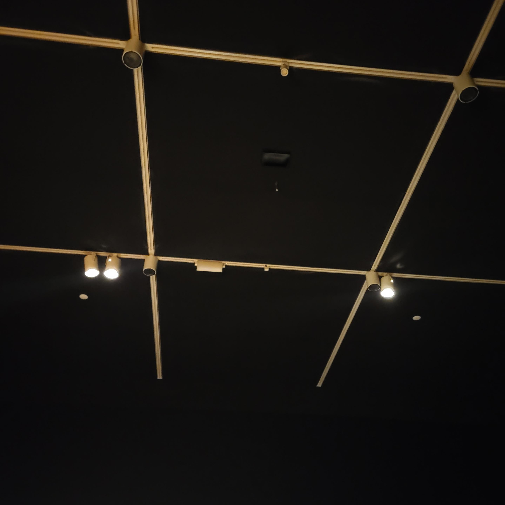
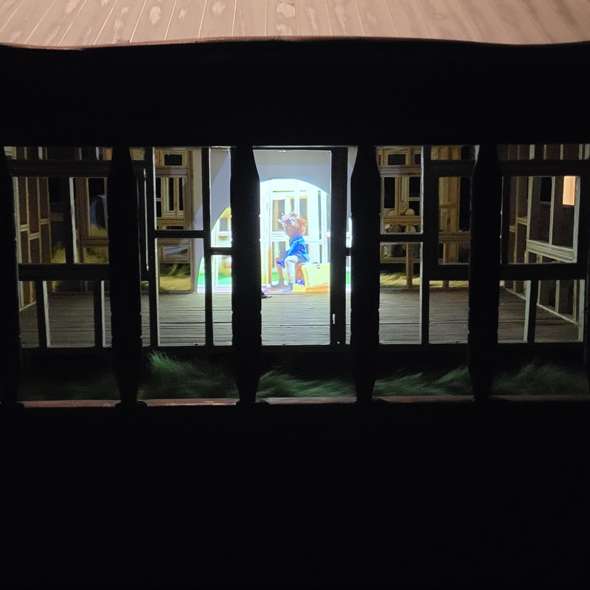
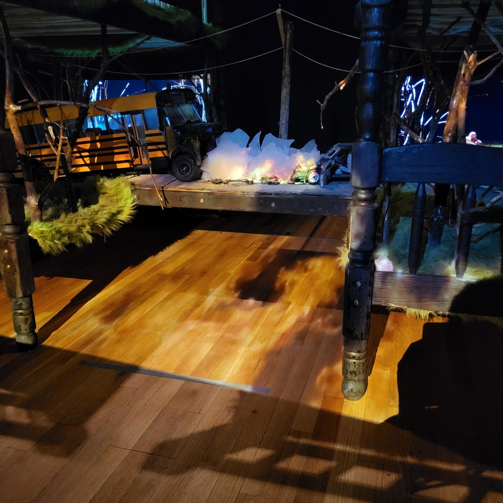

<h1>Camp Wakonda</h1>

 |  
:-------------------------:|:-------------------------:

Le 4 avril 2025, j’ai pu observer une œuvre faite par Graeme Patterson; Camp Wakonda. 
  

 |  
:-------------------------:|:-------------------------:

Au fond d’une grande salle d’exposition du musée des beaux-arts de Montréal se trouve une plus petite salle très sombre à l’ambiance un peu désorganisée et lugubre. Au centre se trouve une maquette constituée de deux lits à deux étages en bois noir comme si calciné, des structures de maison en bois, des projecteurs et au milieu du désordre visuel, une recréation miniature d’un accident de voiture. Un crépitement de feu se fait entendre dans la salle grâce à des hauts-parleurs dissimulés au plafond et une animation de feu est projetée sur le milieu de l’accident entre un autobus miniature et une voiture miniature. Les maisons contiennent des animations toutes différentes produites en stop-motion. Le tout agrémenté de branches d’arbres éparpillées sur le premier étage des lits. Les dispositifs en milieu de salle sont tous branchés discrètement sous un des lits au plancher du musée.
  

 |  
:-------------------------:|:-------------------------:

J’ai vraiment aimé la disposition d’objets communs pour recréer cette scène d’accident. Ces objets donnent l’impression de ne pas avoir été choisis au hasard, quelqu’un proche de l’artiste en comprend probablement la signification. Je dois dire que j’ai eu du mal à lier la pièce centrale de l’oeuvre avec les vidéos projetées dans les diverses structures de maison.
  

 |  
:-------------------------:|:-------------------------:

------------

<h3>SOURCES</h3>
Photos prises par Mateo Rodriguez  

