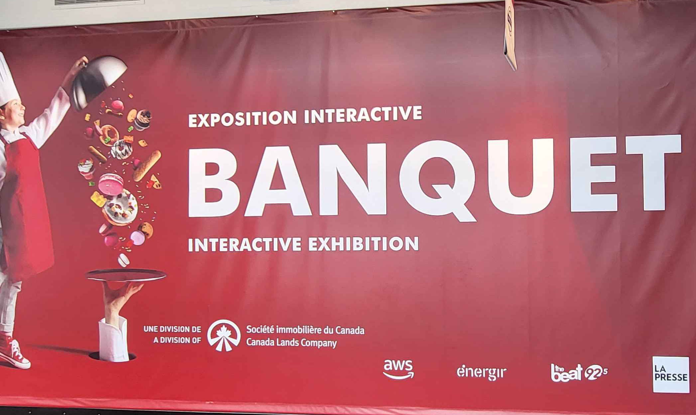
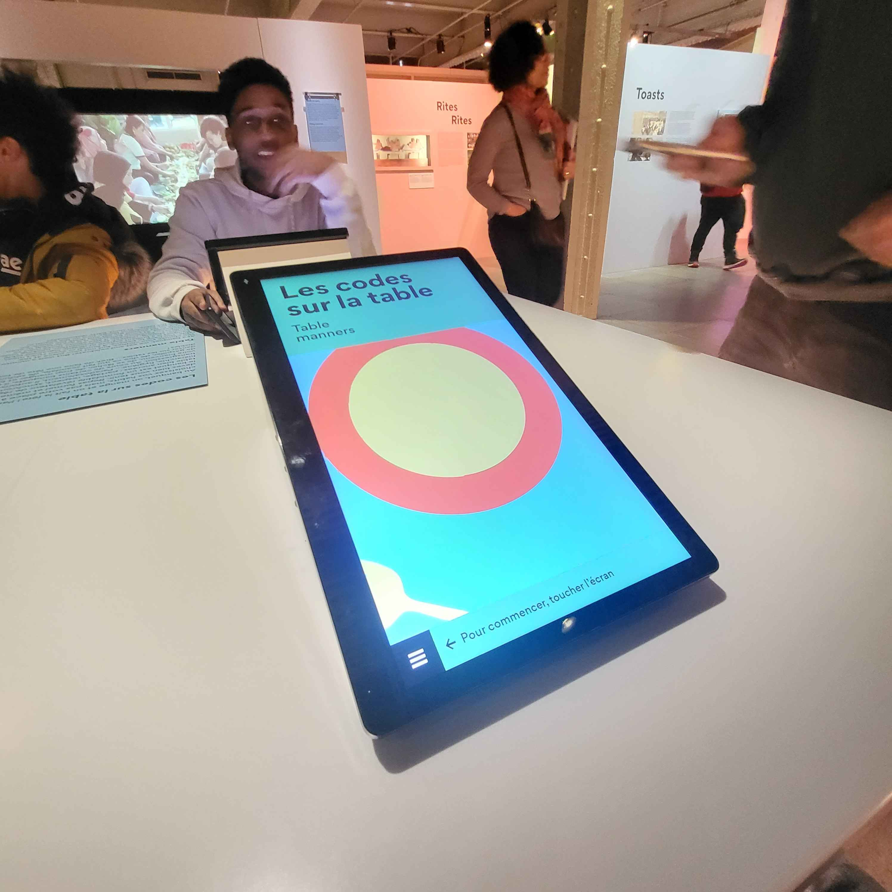

### Le banquet - Les codes sur la table

Le Banquet est une exposition présentée au centre des sciences de montreal. Il s'agit d'une expérience familiale éducative et intéressante pour toute la famille. Cette exposition a débuté le 16 mai 2024 et sera ouverte jusqu'au 16 mars 2025. Nous l'avons visitée le 31 Janvier février.

Un dispositif souvent oublié mais définitivement marquant à tous s'intitule "Les codes sur table". Réalisée par la compagnie "cité" en partenariat avec "inrae", cette table à six places est munie de 6 écrans tactiles qui vous conduiront à travers d'une liste de questions par rapport à l'étiquette de table. Après avoir répondu à une question à l'aide des options disponibles, les résultats que la machine a obtenu auparavant s'afficheront sur l'écran en pourcentage. 
Cette installation repose sur l'interactivitée puisqu'elle nous informe sur les manières des autres personnes qui l'ont visité.

