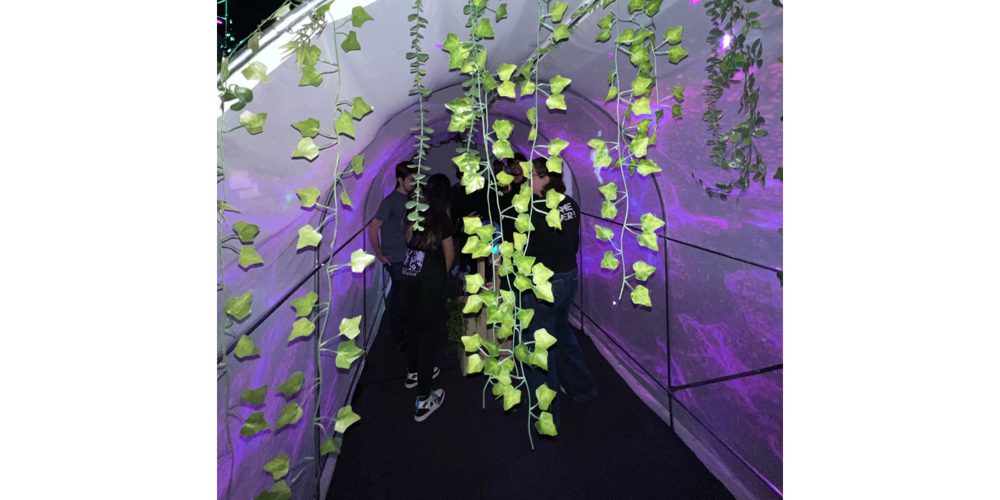
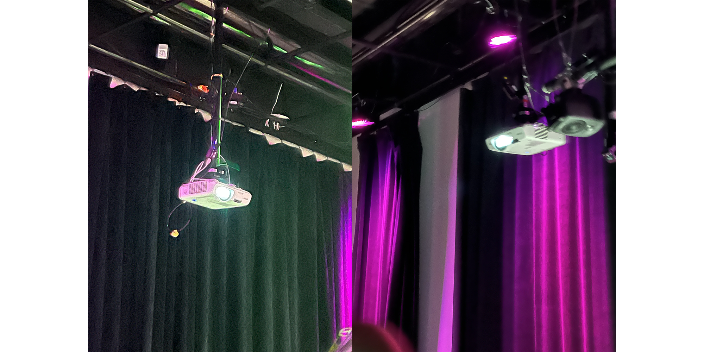

<h1>Mon installation coup de coeur; Internature</h1>

 | 
:-------------------------:|:-------------------------:
 
Internature est une oeuvre concue par Khaly Tia Sing, Isaac Fafard, Delphine Grenier, Sitmonternna Yi et Kenza El Harrif.
L'installation est très unique car elle se controle à l'aide d'un dispositif qui utilise la technologie d'une kinect pour suivre le mouvement d'une sphère qui influence les sons et projections sur le tunnel qui vous entoure. Des projecteurs sont suspendus du plafond de chaque cotés de la salle et projettent l'imagerie sur la tente-tunnel au milieu de la salle.

*photos par Pablo Pereira*
  

La section plantation du Github de l'équipe est très complète ! La Gallerie est bien fournie de photos et videos diverses. Les images de plantation ont un style particulier très professionel et accessible. 

 |  | 
:-------------------------:|:-------------------------:

 |  | 
:-------------------------:|:-------------------------:
*tout schéma de plantation est fourni par le github de l'équipe.*

 
https://tprangers.github.io/internature/#/30_production/60_plantation/
  
Au début j'ai pensé que le tunnel était peut-être une peu inutilement gros mais après l'avoir essayé et expérimenté jai trouvé que l'idée était vraiment unique et que les projections fonctionnaient vraiment bien.
  
Pour cette installation je pense à trois cours indispensables; 
-Traitment audiovisuel 
-Conception d’une expérience multimédia
-Objets interactifs

