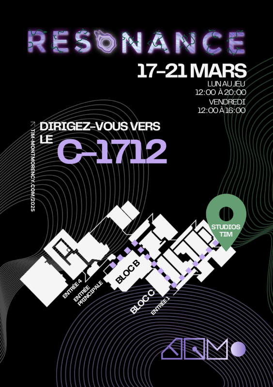

<h1>Mon installation coup de coeur; Internature</h1>

    
  Photo tirée du site de l'exposition. (https://tim-montmorency.com/2025/#/)

 | 
:-------------------------:|:-------------------------:

 Réalisée dans le cadre de l'exposition "RÉSONANCE" au collège Montmorency de Laval, Internature est une oeuvre concue par Khaly Tia Sing, Isaac Fafard, Delphine Grenier, Sitmonternna Yi et Kenza El Harrif. L'installation est très unique car elle se controle à l'aide d'un dispositif qui utilise la technologie d'une kinect pour suivre le mouvement d'une sphère qui influence les sons et projections sur le tunnel qui vous entoure. Des projecteurs sont suspendus du plafond de chaque cotés de la salle et projettent l'imagerie sur la tente-tunnel au milieu de la salle.
  
Pour rendre l'expérience possible, l'équipe à fait usage de plusieurs logiciels comme Reaper, Vcv Rack, Touchdesigner et d'autres. Ils ont aussi eu besoin de beaucoup d'outils physiques comme des projecteurs haute résolution, des haut parleurs, des LEDs adressables et bien sûr, le grand tunnel de toile. Le grand studio dans lequel l'exposition avait lieu est équipé d'une structure de rails au plafond qui a servi ici à fixer les projecteurs. Il y a aussi une multitude de prises électriques répendues dans le studio pour faciliter l'organisation des cables d'alimentation des divers machines.

*photos par Pablo Pereira*
  

La section plantation du Github de l'équipe est très complète ! La Gallerie est bien fournie de photos et videos diverses. Les images de plantation ont un style particulier très professionel et accessible. 

 |  | 
:-------------------------:|:-------------------------:

 |  | 
:-------------------------:|:-------------------------:

*tout schéma de plantation est fourni par le github de l'équipe. https://tprangers.github.io/internature/#/30_production/60_plantation/*

 
J'ai eu la chance de visiter et essayer cette installation le 25 février 2025. Au début j'ai pensé que le tunnel était peut-être une peu inutilement gros mais après l'avoir essayé et expérimenté jai trouvé que l'idée était vraiment unique et que les projections fonctionnaient vraiment bien. Elle est considérée une oeuvre intéractive mais je pense que l'intéractivitée est difficilement représenté. Je pense que si le principe de l'oeuvre était plutôt de faire un jeu avec la technologie intéressante que l'équipe à utilisée, le public aurait eu bien d'avantage d'intérêt pour cette oeuvre. Dès que j'ai défiler à travers des photos disponibles sur leur Github, j'ai instantanément pensé à un mini-jeu de rouler la sphère pour trouver la sortie d'un labyrinthe. Les projections avaient tellement de potentiel et je pense que le produit final ne meet pas assez en valeur les projecteurs et leur technologie unique.
  
Pour cette installation je pense à trois cours indispensables; 
-Traitment audiovisuel 
-Conception d’une expérience multimédia
-Objets interactifs

  
<h2>SOURCES</h2>
GitHub de l'équipe derrière le projet; [GitHub INTERNATURE](https://tprangers.github.io/internature/#/)  
Grille de cours du programme TIM Montmorency; [Techniques d’intégration multimédia - 582.A1](https://www.cmontmorency.qc.ca/programmes/nos-programmes-detudes/techniques/techniques-dintegration-multimedia/grille-de-cours/)

