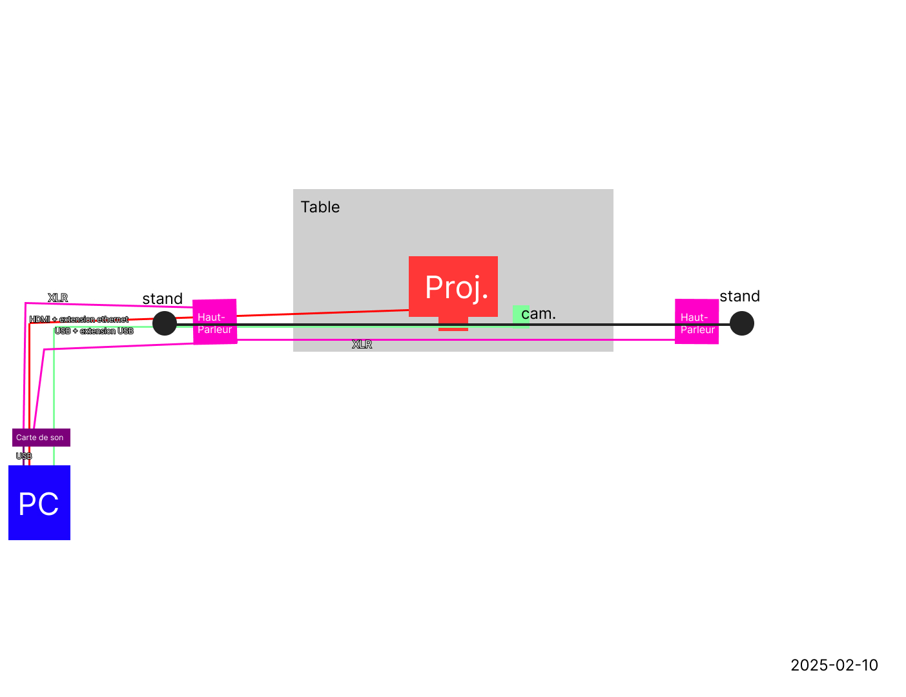

<h1> Expositions intéractives finissants TIM dans le cadre de l'exposition Résonnance</h1>

    
  Photo tirée du [site de l'exposition.](https://tim-montmorency.com/2025/#/)

 

<h3>Projets présentés ;</h3>

1 - Internature
 
Une expérience audiovisuelle qui utilise une sphère pour controler des lumières et des sons projetées sur un tunel tout autour de vous.
  
2 - Luminatura
 
Un dispositif se basant sur des platformes tactiles pour afficher et changer des couleurs.
  
3 - Fuga
 
Un dispositif à boutons et faders qui influence la croissance d'un arbre virtuel.
  
4 - Etheria
 
Un jeu intéractif projeté sur une table.
  
5 - C0NDU8
 
Un dispositif qui nous fait faire du sport virtuel à l'aide d'un vélo stationnaire.
  
6 - Arcadia
 
Un jeu d'arcade old school joué avec une manette old school.
  
7 - Prismatica
 
Une expérience audio visuelle qui joue sur les couleurs pour créer des sons et des ambiances.

------------

Ces expositions présentées dans divers locaux du collège montmorency sont créés en guise de projet final de leur formation en technique d'intégration multimedia.

------------

<h2>Internature</h2>
Internature est une oeuvre concue par Khaly Tia Sing, Isaac Fafard, Delphine Grenier, Sitmonternna Yi et Kenza El Harrif. L'installation est très unique car elle se controle à l'aide d'un dispositif qui utilise la technologie d'une kinect pour suivre le mouvement d'une sphère qui influence les sons et projections sur le tunnel qui vous entoure. 
  

*photo de Pablo Pereira*
 

La section plantation du Github de l'équipe est très complète !
  

 |  | 
:-------------------------:|:-------------------------:

 |  | 
:-------------------------:|:-------------------------:

*Tout schéma de plantation est fourni par le [GitHub de l'équipe.](https://tprangers.github.io/internature/#/30_production/60_plantation/)*
  
Au début j'ai pensé que le tunnel était peut-être une peu inutilement gros mais après l'avoir essayé et expérimenté jai trouvé que l'idée était vraiment unique et que les projections fonctionnaient vraiment bien.

 

<h2>Luminatura</h2>
Luminatura est une magnifique oeuvre pensée et réalisée par Audrey Dandurand, Camilia Bouatmani, Ihab Mouhajer et Prethiah Rajaratnam. Ce projet est une collection de lumières, projections et un peu de son aussi. Trois plaques tactiles sont devant vous et elles sont éclrairées assez pour les voir dans la grande salle plongée dans l'obscuritée. Sur le plancher en face, une grande projection de lumières abstraites se promène et change de couleur au toucher des plaques. Au mur, une grande lumière similaire à celle au sol change également de couleur grâce aux plaques tactiles. Ces lumières se promènes et bougent sur les surfaces sur lesquelles elles sont projetées. Au plafond, des lustres pendent et suivent la couleur de la lumière des murs.
  

 |  
:-------------------------:|:-------------------------:

*Photos tirés du [GitHub de l'équipe](https://miaou-mafia.github.io/projet-luminatura/#/50_diffusion/)*

La section plantation du Github de l'équipe est très simple et efficace !

 |  
:-------------------------:|:-------------------------:

*Tout schéma de plantation est fourni par le [GitHub de l'équipe.](https://miaou-mafia.github.io/projet-luminatura/#/30_production/60_plantation/)*
  
Lorsque j'ai vu cette installation j'ai automatiquement pensé qu'elle était la plus belle et je le pense encore mais l'intéractivitée laisse à désirer. Je trouve qu'on ne retrouve pas une réponse très claire que ce qu'on fait sur les tablettes influence réellement ce qu'on voit car on est souvent pas les seuls à toucher aux tablettes à la fois donc il était difficile de savoir si ce que je faisais était de moi ou des autres personne qui essayaient les autres tablettes. 

 

<h2>Fuga</h2>
Fuga est une oeuvre réalisée par Abdel Ali Djeral, Daniel Dezemma, Matis Labelle, Tristan Khadka et Yavuz-Selim Gucluer. Cette installation est la seule du lot qui utilise des écrans. La disposition des éléments est très originale. Sur une table étroite mais haute d'environs un mètre et quart, des petits boutons et des faders nous permettent de controller la pousse d'un arbre qui est le sujet de cette installation. Trois écrans sont attachés à un support au plafond et affichent le progrès de l'arbre dans sa croissance. Des haut parleurs sont montés sur ce même support et jouent de l'audio qui varie selon l'intéraction avec les controles. La disposition des éléments est très bien pensée pour ce projet, ils ont même pensé à orner le tout de petits feuillages et plantes en plastique. 
  

 |  
:-------------------------:|:-------------------------:

*Photos par Mateo Rodriguez*
 

La section plantation du Github de l'équipe est belle simple et efficace !

 | 
:-------------------------:|:-------------------------:

*Tout schéma de plantation est fourni par le [GitHub de l'équipe.](https://escapism-fuga.github.io/Fuga/#/30_production/60_plantation/)*
 
Je pense que cette oeuvre donnait déja le sentiment d'être finie et prête à présenter au grand public. Les éléments visuels étaient profesionnels et le son semblait très naturel. Je ne saurait quoi dire de négatif par rapport à cette installation.

 

<h2>Etheria</h2>
Etheria est une oeuvre concue par Victor Gileau, Maik Hemel Micheal Un Dupré, Joshua Gonzalez-Barrera et Pierre-Luc Proulx. C'est un jeu video projeté sur une table en guise d'écran. Pour y jouer, vous devez utiliser des petits objets munis de codes pour controler un des trois personnages. Chaque personnage à une classe et se joue d'une manière différente. Des ennemis arrivent du haut de l'écran et il faut défendre le bas. Plutôt simple mais vraiment efficace. 
  

 

*Photo tiré du [GitHub de l'équipe](https://ethereal-creators.github.io/Etheria/#/50_diffusion/)*
 
La section plantation du Github de l'équipe est difficile à comprendre et plutôt incomplette à mon avis. Elle n'est pas vraiment compréhensible facilement de tous car toutes les lignes se chevauchent.

*Tout schéma de plantation est fourni par le [GitHub de l'équipe.](https://ethereal-creators.github.io/Etheria/#/30_production/60_plantation/)*

J'ai vraiment eu du plaisir à regarder mes amis jouer au jeu de cette équipe. Je pense que la détection des objets qui controlent le jeu pourrait être travaillée et la partie était un peu longue à mon goût mais ce sont probablement les seules remarques que j'ai à faire. 

 

<h2>C0NDU8</h2>
C0NDU8 est un dispositif réalisé par Ian Corbin, Samuel Desmeules Voyer, Alexandre Gervais, Kevin Malric et Jérémy Roy Coté. Leur projet est assez simple en pratique, c'est un vélo stationnaire connecté à un programe. Un jeu est projetté sur un mur à l'aide d'un projecteur. Le but est de pédaler le plus vite possible pour gagner une course contre d'autres cyclistes virtuels. 
  

 
*Photo de Mateo Rodriguez*
 
La section plantation du Github de l'équipe est satisfaisante pour le projet présenté.

 
*Tout schéma de plantation est fourni par le [GitHub de l'équipe.](https://escapism-fuga.github.io/Fuga/#/30_production/60_plantation/)*
 

J'ai pensé que cette idée était incroyable la seconde que je l'ai vue, mais je n'ai pas gardé cet opinion longtemps. Cette installation a besoin de travail dans l'état que je l'ai vue. Le premier réflexe d'une personne sur deux qui essaie leur installation est depédaler le plus vite possible pour le plus longtemps possible mais je pense vraiment que l'équipe de dévloppement n'y avait pas pensé. L'animation du personnage qui pédale est bien trop vite quand l'utilisateur pousse le vélo à ses limites et le vélo lui même fait une bruit d'enfer qui enterrait tout ce qu'on disait autour du dispositif. Je pense que ce projet à un avenir très prométteur mais il faudra y mettre du travail.

 

<h2>Arcadia</h2>
Arcadia à été réalisé par Dominic Yale, William Beauvais et Anton Nikulin. Ce projet est probablement celui qui cherche le moins à être unique en pratique. Il s'agit d'un jeu d'arcade avec des boutons et un joystick pour y jouer comme si c'étais une borne d'arcade old school. Le projet à été pensé avec l'idée de vouloir un jeu à "speedrun", une pratique qui consiste à essayer de finir le jeu en le moins de temps possible.
  

*Photo de Mateo Rodriguez*
 
Je pense que ce projet à besoin d'une vraie borne d'arcade physique pour y arriver. Lorsque j'ai vu ce projet installé sur un ordi et que j'ai ensuite appris le but derrière, j'ai été un peu décu.
 
On peut vraiment s'imaginer ce que l'équipe à voulu réaliser mais sans un support physique comme les autres installations, le projet n'est réellement qu'un jeu video. C'est pourquoi je pense qu'avoir une borne d'arcade faite sur mesure avec des lumières et des hauts parleurs qui répondent à ce qui se passe en jeu.

 
La section plantation du Github de l'équipe est extrèmement minime comparée aux autres équipes.
 

 

*Tout schéma de plantation est fourni par le [GitHub de l'équipe.](https://escapism-fuga.github.io/Fuga/#/30_production/60_plantation/)*

J'ai pu revisiter les expositions plus tard lors du vernissage à l'école dans le grand studio et je dois dire que Arcadia a bien avancé. L'équipe a trouvé une borne d'arcade vierge et a intégré leur jeu dedans de manière professionnelle et propre. La borne est entièrement noire mais pour un projet étudiant, je n'aurait pas exigé qu'il trouve un artiste pour la customiser. La borne elle même est satisfesante à voir.
  

*Photo de Mateo Rodriguez*

<h2>Prismatica</h2>
Prismatica a été concue par Vincent Delisle, Ikrame Rata et Jérémy Duverseau. C'est une installation qui porte se base sur les dessins que l'utilisateur fait sur une surface pour jouer des sons et projeter des lumières sur un mur. L'installation ne marchait pas vraiment au moment où j'ai pu la côtoyer et je n'ai pas totalement saisi comment elle allait fonctionner.

 |  |
:-------------------------:|:-------------------------:

*Photos tirés du [GitHub de l'équipe](https://pootpookies.github.io/Prismatica/#/)*

La section plantation du Github de l'équipe est très complète.
 

 

 |  | 
:-------------------------:|:-------------------------:

 |  | 
:-------------------------:|:-------------------------:

*Tout schéma de plantation est fourni par le [GitHub de l'équipe.](https://pootpookies.github.io/Prismatica/#/30_production/60_plantation/)*

Je pense que cette installation est encore trop primitive pour que je puisse en donner un opinion. L'équipe derrière passait son temps à essayer de faire fonctionner leur projet.

