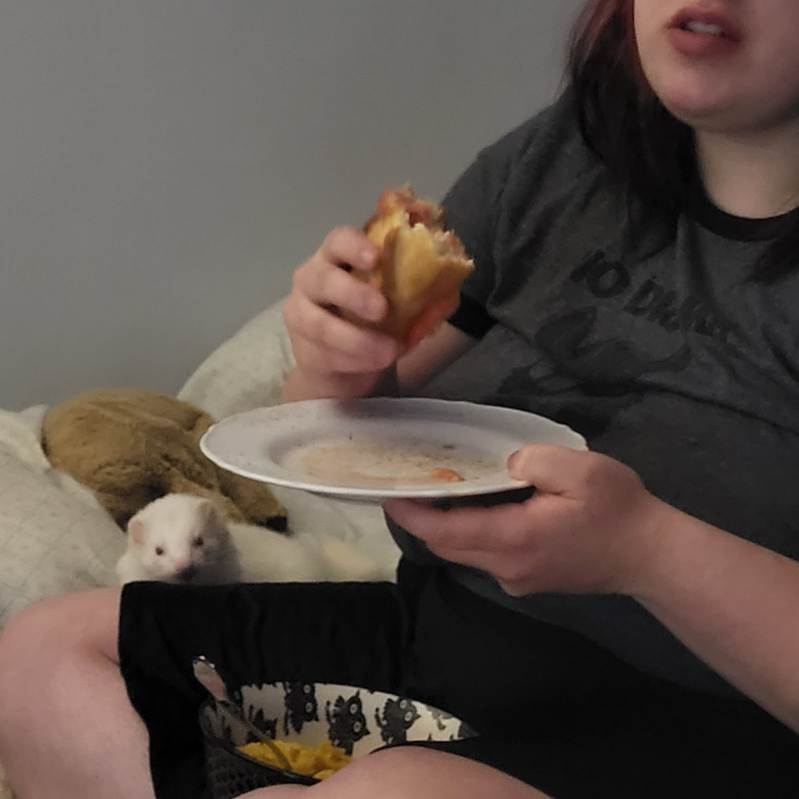

<h1>Mateo Rodriguez Fontaine</h1>

Bonjour je suis fasciné des arts visuels virtuels depuis un concert auquel j'ai assisté dans ma jeunesse. Je me souviens à quel point le support visuel était important pour l'expérience générale. Depuis je me suis informé des chemins professionels qui pouvaient me mener à un métier qui pourrait me rapprocher de ce monde visuel.

Depuis, j'ai une vrai passion pour assister à des concerts et en remplir un petit site que j'ai créé lors de mes cours  de web.

