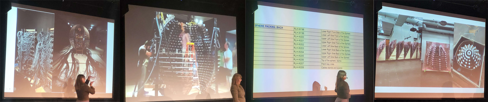
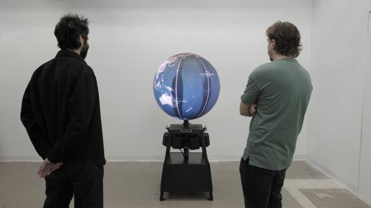

<h1>Conférence Studio Lozano Hemmer</h1>
<h3>présenté par Jade Séguela</h3>

  Le 25 mars 2025, nous avons eu la chance d'assister à une présentation présentée par Jade Séguela, la registraire du studio de Rafael Lozano-Hemmer. Elle nous a présenté deux oeuvres captivantes."Sphere Packing: Bach" et "Shadow Tuner"
  
  Pour commencer, "Sphere Packing: Bach", est une oeuvre réalisée avec idée d'inclure toutes les compositions de Johann Sebastian Bach dans une structure que les visiteurs peuvent entrer. Cette expérience devient rapidement une cacophonie de haut niveau, ce qui rajoute à l'expérience un charme très brut et un peu viloent. Les onze kilomètres de cables qui connectent les hauts-parleurs aux ordinateurs viennent aussi ajouter une ambiance pesante presque épeurante à l'oeuvre.
  
  

  
   
  "Sphere Packing: Bach", photo tirée du site de Rafael Lozano-Hemmer.
  

  
  Crée en 2018, cette oeuvre est une prouesse de l'organisation technique. La concevoir physiquement et la transporter étaient des défis selon Jade. Elle nous à montrée de quoi son organisation logistique avait l'air ainsi que son organisation physique comme les boites utilisées pour transporter le matériel.

  

  
   
    Photos de la conférence prises par Mateo Rodriguez
  

  Par la suite, l'oeuvre "Shadow Tuner" à été réalisée sur une petite île artificielle à Abu Dhabi dans les Émirats arabes   unis. L'objectif de l'oeuvre est de prendre l'angle d'une personne par rapport à la sphere et diffuser une station de radio aux haut-parleurs de la salle. Cette sphere au milieu de la salle est mappé à la carte du monde. 

    

  
   
    Photos de la conférence prises par Mateo Rodriguez
  

  
  Jade nous a présenté les difficultées rencontrées comme le vent, le sable et l'incapacité de traviller de jour puisque l'oeuvre était une projection sur un grand globe gonflable. Une version minature à été concue pour être plus facilement exposable. 

  Pour finir, l'atelier Lozano-hemmer est un studio d'environs 40 employés soit le plus grand à Montreal. À sa tête, Rafael Lozano-Hemmer continue de développer des nouvelles oeuvres tout les ans depuis avec son équipe depuis le début des années 90'.
   
   
<h3>Références</h3>
    
Site de Rafael Lozano-Hemmer. (https://www.lozano-hemmer.com/)
